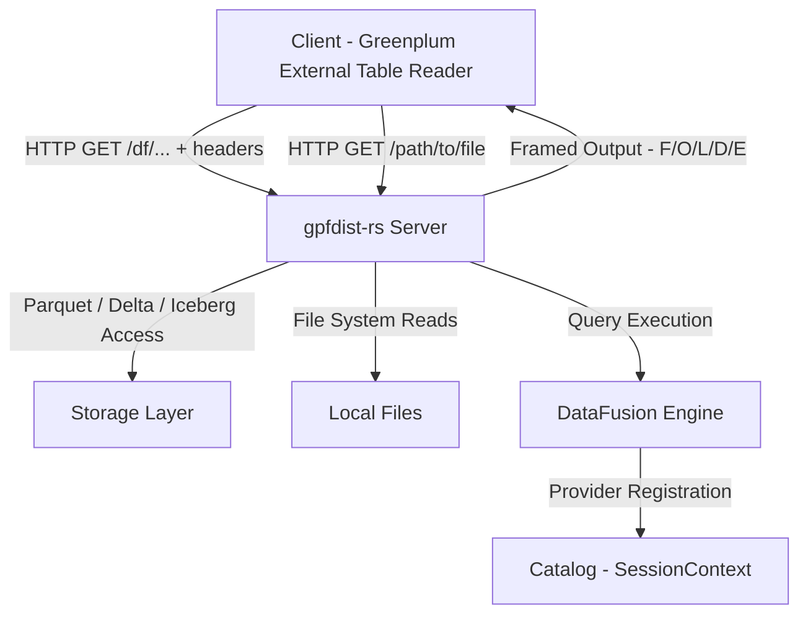
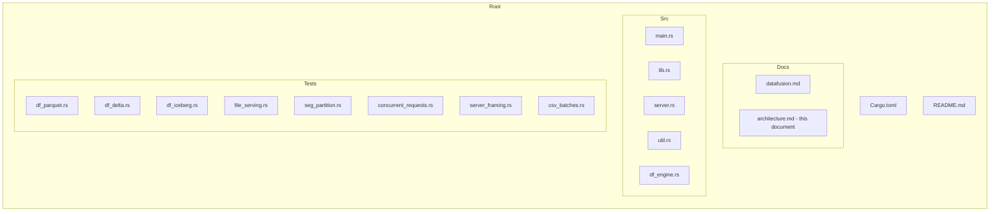
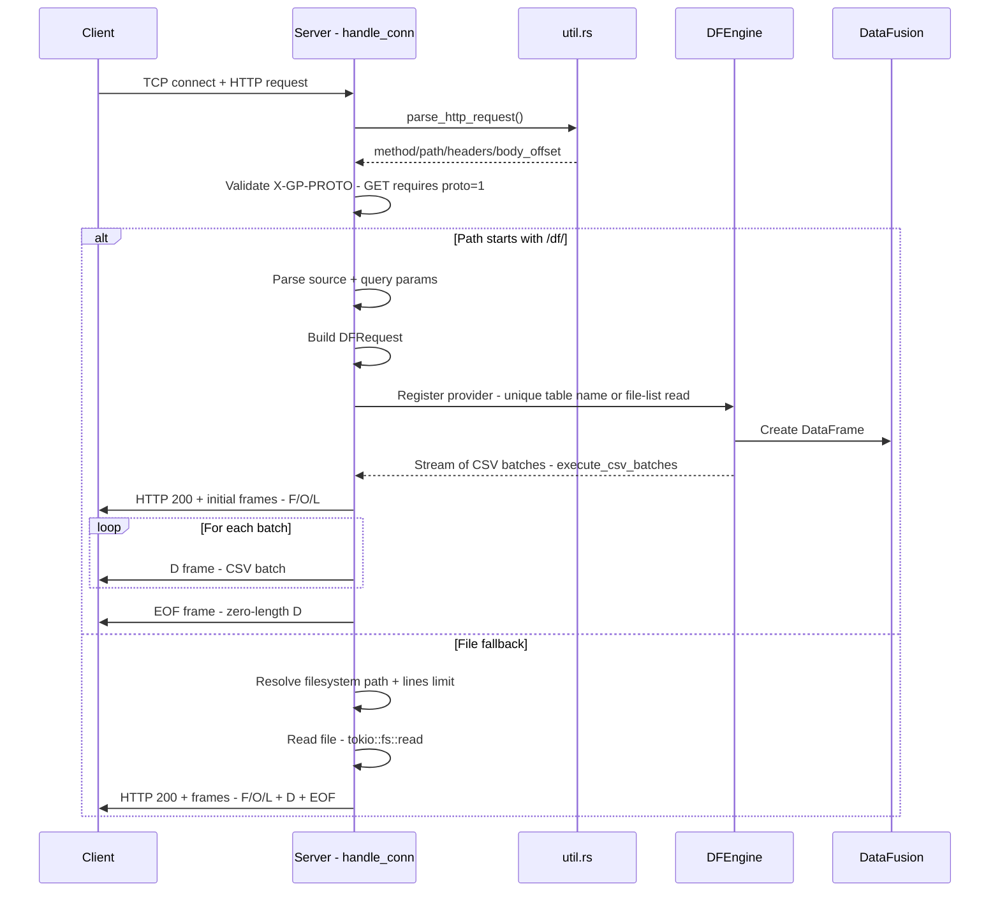
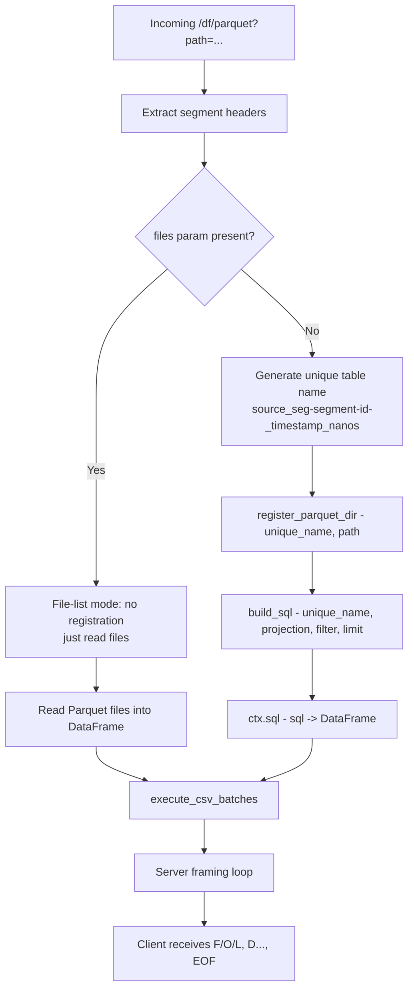
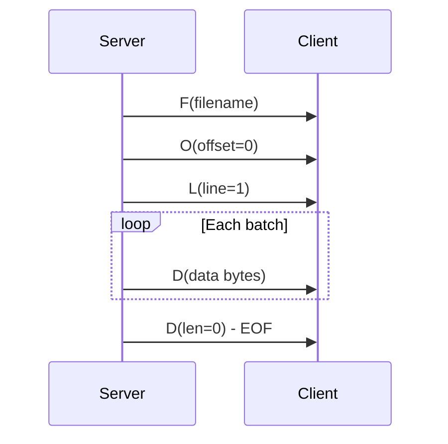
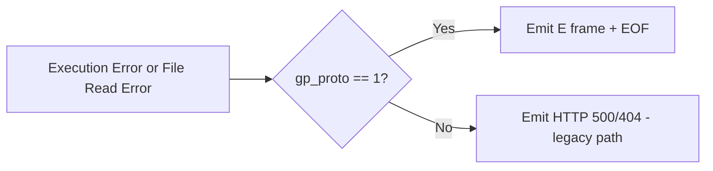
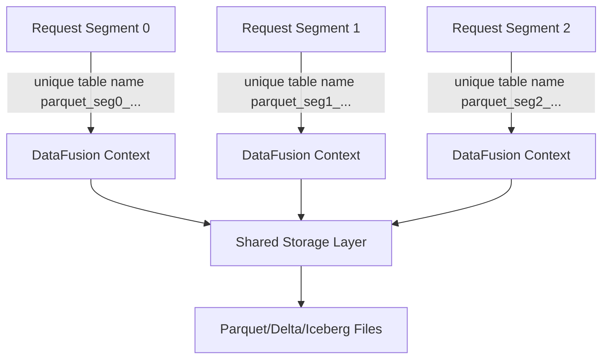
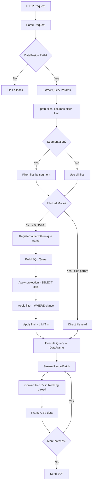

# gpfdist-rs Architecture

This document describes the high-level architecture, module responsibilities, data flow, and protocol framing of the `gpfdist-rs` project.  
All terminology and labels are in English.

## 1. High-Level Component Overview



The server acts as a bridge between Greenplum's external table readers and various data sources, providing both traditional file serving and advanced DataFusion-based query capabilities.

## 2. Repository Structure



## 3. Request Handling Flow

### 3.1 Common Request Processing



## 4. DataFusion Directory Mode (Unique Table Name Logic)



The unique table name strategy prevents collisions when multiple concurrent requests access the same path with different segments or filters.

## 5. gpfdist Protocol Framing (GET Mode)

### 5.1 Frame Types

| Frame | Purpose | Occurrence |
|-------|---------|------------|
| F     | Filename / logical label | Once at start |
| O     | Byte offset (start)      | Once at start (initial 0) |
| L     | Starting line number     | Once at start (initial 1) |
| D     | Data chunk (CSV bytes)   | Repeated per batch |
| D (len=0) | EOF marker          | Once at end |
| E     | Error message            | Only on error (followed by EOF) |

### 5.2 Frame Sequence



### 5.3 Frame Structure

Each frame consists of:
```
[Type:1 byte][Length:4 bytes][Line/Offset:4 bytes][Data:Length bytes]
```

The Length field indicates the size of the Data portion. For F/O/L frames, the data is typically a fixed-size value (e.g., filename, offset value, line number).

## 6. Module Responsibilities

| Module        | Responsibility |
|---------------|----------------|
| main.rs       | Application entry point, CLI argument parsing, logging initialization |
| server.rs     | TCP accept loop, HTTP parsing, protocol enforcement (GET requires proto=1), routing logic, framing implementation, file fallback handling |
| util.rs       | HTTP parsing helpers, response header construction, query map parsing, percent-decode utilities |
| df_engine.rs  | DataFusion abstraction layer: session setup, provider registration, SQL query building, CSV batch execution |
| docs/datafusion.md | Endpoint usage documentation, parameters reference, examples |
| tests/*       | Integration & behavior validation: framing correctness, segmentation logic, provider features, concurrency safety |

## 7. Error Handling Strategy



**Note:** Current implementation forces GET requests to use `gp_proto=1`, making the E+EOF error path the dominant error handling mechanism.

## 8. Line and Offset Tracking

The server maintains accurate line and offset tracking for protocol compliance:

- **offset**: Cumulative byte count of data successfully sent in D frames
- **line_no**: Starts at 1; incremented by the number of CSV lines in each batch
- **Line counting**: Uses `bytecount::count(csv_bytes, b'\n')` with optional adjustment if the last line lacks a newline character

This tracking is essential for:
- Resumable reads (theoretical support)
- Client-side debugging and progress monitoring
- Protocol compliance with gpfdist specification

## 9. Concurrency Considerations



### 9.1 Concurrency Strategy

- **Unique Table Names**: Each request generates a unique table name based on source, segment ID, and timestamp (nanoseconds)
- **Shared SessionContext**: All requests share the same DataFusion `SessionContext`, but register distinct table names
- **Isolation**: Different segments or concurrent requests to the same path are isolated through unique table registrations
- **Thread Safety**: DataFusion's SessionContext is thread-safe (`Arc`-wrapped)
- **Async Runtime**: Tokio runtime handles concurrent connections efficiently

## 10. DataFusion Execution Path (Detailed)



### 10.1 Optimization Points

1. **Projection Pushdown**: Only requested columns are read from storage
2. **Predicate Pushdown**: Filters are pushed to Parquet/Delta/Iceberg readers when possible
3. **Batch Processing**: Data streams in batches, minimizing memory usage
4. **Parallel CSV Encoding**: CSV conversion happens in blocking thread pool
5. **Segment-level Parallelism**: Multiple segments can process data in parallel

## 11. Security Considerations

| Concern | Current Status | Mitigation / Notes |
|---------|----------------|-------------------|
| Path Traversal | Vulnerable | No sanitization of path parameters; clients can access arbitrary filesystem paths |
| Authentication | None | No user authentication or authorization mechanism |
| TLS/SSL | Not Supported | All traffic is unencrypted |
| Input Validation | Minimal | Query parameters are percent-decoded but not sanitized |
| SQL Injection | Low Risk | SQL is built programmatically, not concatenated from user input |
| Resource Limits | None | No limits on query complexity, memory usage, or concurrent connections |
| DoS Protection | None | No rate limiting or connection throttling |

**Recommendation**: Deploy gpfdist-rs behind a reverse proxy with proper authentication, path restrictions, and TLS termination for production use.

## 12. Future Extension Points

### 12.1 Protocol Extensions

- **Arrow IPC Streaming (gp_proto=2)**: Direct Arrow IPC format for zero-copy data transfer
- **Compression**: Support gzip/snappy compression for D frames
- **Chunked Transfer Encoding**: Better HTTP/1.1 compliance

### 12.2 Query Capabilities

- **Version/Timestamp Pinning**: Support for Delta/Iceberg time travel queries
- **Advanced Pushdown**: Custom optimization rules for complex predicates
- **Aggregate Pushdown**: Allow GROUP BY aggregations with pushdown
- **Join Support**: Multi-table queries via DataFusion

### 12.3 Data Source Support

- **S3/Cloud Storage**: Native object store integration via DataFusion
- **Avro/ORC**: Additional file format support
- **Database Connectors**: PostgreSQL, MySQL integration via DataFusion

### 12.4 Operational Features

- **Metrics/Observability**: Prometheus metrics, tracing integration
- **Authentication**: OAuth2, JWT, basic auth support
- **TLS**: Native TLS support without reverse proxy
- **Configuration**: YAML/TOML config file support
- **Caching**: Query result caching for repeated queries

### 12.5 Performance Enhancements

- **Connection Pooling**: Reuse connections for multiple requests
- **Prepared Statements**: Cache query plans for repeated patterns
- **Adaptive Batch Sizing**: Dynamic batch size based on data characteristics
- **SIMD Optimization**: Leverage Arrow's SIMD capabilities for CSV encoding

## 13. Testing Strategy

The project includes comprehensive integration tests covering:

| Test File | Coverage |
|-----------|----------|
| df_parquet.rs | Parquet queries with proto 0/1, projection, filter, limit |
| df_delta.rs | Delta Lake queries (requires delta feature) |
| df_iceberg.rs | Iceberg placeholder tests |
| seg_partition.rs | Segmentation correctness: disjoint subsets, complete union |
| file_serving.rs | Basic file serving, protocol framing |
| concurrent_requests.rs | Thread safety, table name uniqueness |
| server_framing.rs | Frame structure correctness |
| csv_batches.rs | CSV encoding, batch processing |

Tests are marked `#[ignore]` by default and require a test environment setup.

## 14. Known Limitations

1. **Iceberg Support**: Currently a placeholder implementation
2. **Arrow IPC**: Not yet implemented (gp_proto=2)
3. **Time Travel**: Delta/Iceberg always use latest snapshot
4. **Resource Management**: No query timeout or memory limits
5. **Security**: No authentication, authorization, or TLS
6. **Path Validation**: Arbitrary filesystem access possible
7. **Error Recovery**: No retry mechanism for transient failures

## 15. Glossary

| Term | Definition |
|------|------------|
| gpfdist | Greenplum parallel file distribution protocol |
| gp_proto | Protocol version header (0=raw CSV, 1=framed) |
| Segment | Logical partition unit for parallel data processing |
| F/O/L/D/E Frames | Protocol frame types: File, Offset, Line, Data, Error |
| DataFusion | Apache Arrow SQL query engine |
| Projection Pushdown | Reading only required columns from storage |
| Predicate Pushdown | Applying filters at storage layer |

## 16. References

- [DataFusion Integration Guide](datafusion.md)
- [Apache Arrow DataFusion Documentation](https://arrow.apache.org/datafusion/)
- [Delta Lake Documentation](https://delta.io/)
- [Apache Iceberg Documentation](https://iceberg.apache.org/)
- [Greenplum gpfdist Protocol](https://docs.vmware.com/en/VMware-Greenplum/index.html)
